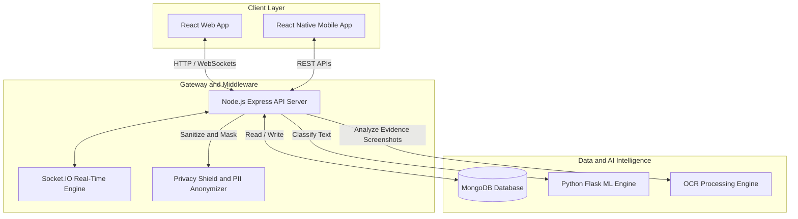
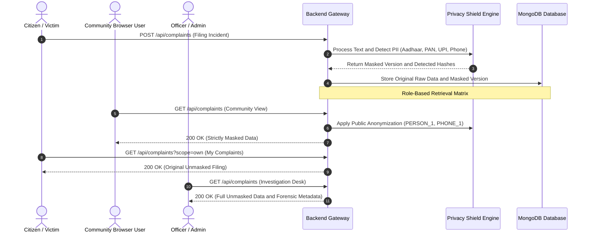
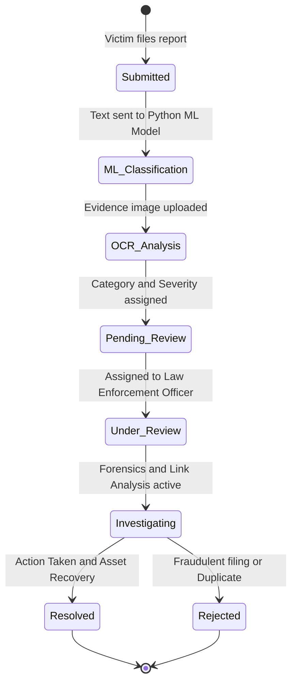
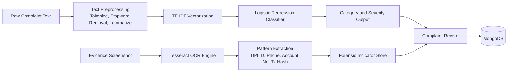
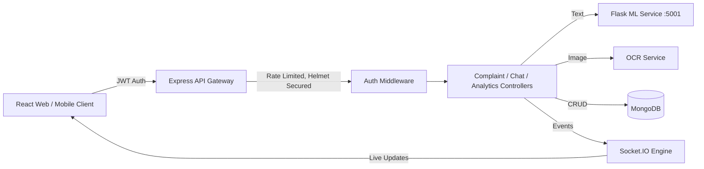

# CyberGuard AI — Cybercrime Reporting & Forensic Intelligence Platform

[](https://github.com)
[](https://nodejs.org)
[](https://reactjs.org)
[](https://python.org)
[](https://github.com)
[](#license)

---

## Overview

CyberGuard AI is an AI-powered cybercrime complaint reporting, investigation, and threat intelligence system. It follows a **zero-trust, role-based privacy architecture**: personal identifiable information (PII) is automatically detected and masked, forensic indicators are extracted from evidence via OCR, incidents are classified using an NLP model, and real-time intelligence is delivered to citizens, forensic investigators, and law enforcement agencies.

---

## Key Features

- **AI Cybercrime Classification** — automated NLP categorization into 11 attack vectors (financial fraud, phishing, ransomware, cyberbullying, hacking, identity theft, and others).
- **Zero-Trust Role-Based Privacy Architecture**
  - **Complaint Owner** — full unmasked access to their own filing.
  - **Officer / Admin** — raw case data, forensic link-analysis graphs, and investigation tools.
  - **Community Browser** — PII automatically anonymized (`PERSON_1`, `PHONE_1`, `EMAIL_1`, `CITY_1`) for safe public browsing of threat patterns.
- **OCR Evidence Intelligence** — extraction of bank accounts, UPI IDs, transaction hashes, and phone numbers from evidence screenshots using Tesseract OCR.
- **Threat Heatmaps & Link Analysis** — geospatial attack maps and suspect relationship graphs.
- **Real-Time Communication** — Socket.IO powered notifications, status tracking, and encrypted chat channels.
- **Interactive AI Assistant** — voice-driven navigation, audio alerts, and platform monitoring.
- **Scam Search & Verification** — cross-referencing of suspect UPI IDs, phone numbers, and financial details against a verified threat database.

---

## System Architecture

### 1. High-Level Platform Architecture



### 2. Multi-Tier Role-Based Privacy & Data Masking Flow



### 3. Complaint Lifecycle & AI Classification Engine



### 4. AI/ML Classification & OCR Pipeline



### 5. Request/Data Flow Across Services



---

## Technology Stack

| Layer | Technologies |
| :--- | :--- |
| **Frontend Web** | React 18, Three.js, Recharts, Framer Motion, Axios |
| **Frontend Mobile** | React Native, Expo, React Navigation |
| **Backend Core** | Node.js, Express.js, MongoDB, Mongoose, Socket.IO |
| **AI / ML Service** | Python 3.10, Flask, scikit-learn, NLTK, TF-IDF + Logistic Regression |
| **Forensics & OCR** | Tesseract.js / Tesseract OCR, Sharp |
| **Security & Auth** | JWT, bcryptjs, Helmet, Express Rate Limit, PII Masking Shield |

---

## Repository Structure

```text
CyberGuard_App/
├── backend/                   Node.js + Express REST API server
│   ├── src/
│   │   ├── config/            Database and service connections
│   │   ├── controllers/       Complaint, Auth, Chat and Analytics logic
│   │   ├── middleware/        JWT auth and error handling
│   │   ├── models/            MongoDB schemas (Complaint, User, Chat, etc.)
│   │   ├── routes/            Express API route definitions
│   │   ├── services/          OCR, SMS, Email and ML service connectors
│   │   └── utils/             Privacy shield and PII masking utilities
│   └── server.js              Entry point and Socket.IO server initialization
│
├── ml-service/                Python Flask AI classification engine
│   ├── src/                   Flask API application
│   ├── models/                Pre-trained TF-IDF vectorizers and ML models
│   ├── train_model.py         Model training pipeline script
│   └── requirements.txt       Python dependencies
│
├── web-app/                   React web application
│   ├── public/                Static assets and voices
│   └── src/
│       ├── components/        Navbar, AI Assistant, CyberReport, Scanner
│       ├── pages/              Dashboard, Community, Admin, Forensics, Settings
│       ├── services/           API Axios client and Socket listener
│       └── hooks/               Zustand auth and theme state management
│
└── mobile-app/                React Native Expo mobile app
    └── src/                   Native screens and components
```

---

## Role-Based Access Matrix

| Feature / View | Regular User (Victim) | Community Browser | Police Officer | Super Admin |
| :--- | :---: | :---: | :---: | :---: |
| File Complaint | Yes | No | Yes | Yes |
| View Own Filings (Unmasked) | Yes | No | Yes | Yes |
| Community Browser (Masked) | Yes | Yes | Yes | Yes |
| View Other's Raw PII | No | No | Yes | Yes |
| Command Center & Forensics | No | No | Yes | Yes |
| Status Update & Resolution | No | No | Yes | Yes |
| System User Management | No | No | No | Yes |

---

## Quick Start Guide (Local Setup)

### Prerequisites
- Node.js v18+
- Python v3.10+
- MongoDB v7.0+ (local instance or MongoDB Atlas cluster)

### Step 1 — Start MongoDB
```bash
# macOS (Homebrew)
brew services start mongodb-community@7.0

# Linux (systemd)
sudo systemctl start mongod
```

### Step 2 — Launch the ML Service
```bash
cd ml-service

python3 -m venv venv
source venv/bin/activate       # Windows: .\venv\Scripts\Activate.ps1

pip install -r requirements.txt
python3 -c "import nltk; nltk.download('punkt'); nltk.download('stopwords'); nltk.download('wordnet')"

python3 train_model.py
python3 src/app.py
```
Runs on `http://localhost:5001`

### Step 3 — Launch the Backend Server
```bash
cd backend
npm install

# Create a .env file with PORT, MONGO_URI, JWT_SECRET, etc.

npm run dev
```
Runs on `http://localhost:5002`

### Step 4 — Launch the React Web App
```bash
cd web-app
npm install
npm start
```
Runs on `http://localhost:3000`

### Step 5 — Launch the Mobile App (optional)
```bash
cd mobile-app
npm install
npx expo start
```
Scan the QR code with the Expo Go app on iOS/Android.

---

## Default Credentials

| Role | Email | Password |
| :--- | :--- | :--- |
| Super Admin | `admin@cybercrime.gov` | `Admin@123456` |
| Police Officer | `officer@cybercrime.gov` | `Officer@123456` |
| Test User | `user@cybercrime.gov` | `User@123456` |

---

## Main API Endpoints

| Method | Endpoint | Access | Description |
| :--- | :--- | :--- | :--- |
| POST | `/api/auth/register` | Public | Register new user account |
| POST | `/api/auth/login` | Public | Login and receive JWT access + refresh tokens |
| POST | `/api/complaints` | Authenticated | Submit new complaint report with evidence |
| GET | `/api/complaints?scope=own` | Authenticated | Get logged-in user's own complaints |
| GET | `/api/complaints?scope=public` | Authenticated | Get all complaints (PII masked for non-owners) |
| GET | `/api/complaints/:id` | Authenticated | Get single complaint detail (role-masked) |
| PATCH | `/api/complaints/:id/status` | Officer / Admin | Update complaint status and add timeline entry |
| GET | `/api/complaints/public/search` | Public | Search suspect phone, UPI, or account numbers |

---

## License

Distributed under the MIT License.